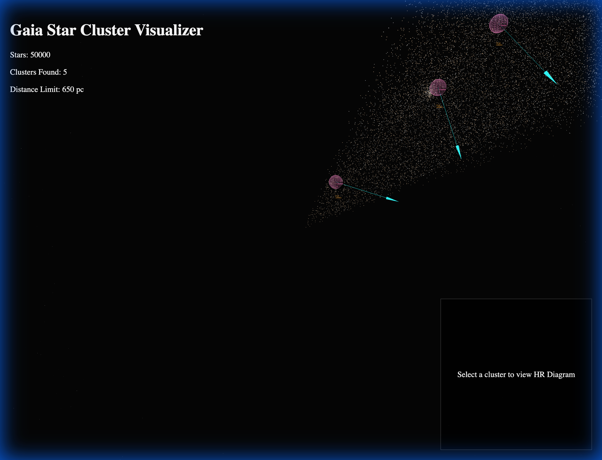

# Gaia Star Cluster Visualizer

A 3D interactive web tool to visualize the Solar Neighborhood (up to 650 parsecs) using data from the European Space Agency's **Gaia mission**. This tool identifies star clusters, detects potential **tidal tails** (stars being stripped from clusters), and provides an interactive **Hertzsprung-Russell (HR) Diagram** for stellar analysis.



### Demo Video


## Features

*   **3D Star Map**: Interactive visualization of ~50,000 stars with realistic positions and colors.
*   **Cluster Detection**: Uses **HDBSCAN** (Hierarchical Density-Based Spatial Clustering) on 6D phase space (Position + Velocity) to find star clusters.
*   **Tidal Tail Analysis**: Automatically identifies "tail candidates"—stars that share a cluster's velocity but are spatially separated, indicating potential disruption by galactic tides.
*   **Interactive HR Diagram**: Click on any cluster to view its Color-Magnitude Diagram ($B_p - R_p$ vs. $M_G$) to estimate age and evolutionary state.
*   **Data Export**: Download cluster data as CSV for further research.

## Project Structure

*   `backend/`: Python scripts for data pipeline and analysis.
    *   `fetch_data.py`: Queries Gaia DR3 via `astroquery` and saves raw data.
    *   `analyze_clusters.py`: Runs HDBSCAN clustering and tidal tail detection algorithms.
*   `frontend/`: React + Vite application for visualization.
    *   `src/components/StarField.jsx`: Renders the massive star cloud using Three.js points.
    *   `src/components/ClusterHighlighter.jsx`: Visualizes cluster cores, velocity vectors, and tidal tail labels.
    *   `src/components/HRDiagram.jsx`: Renders the interactive 2D plot using Recharts.
*   `gaia_analysis.ipynb`: Jupyter Notebook for interactive data exploration and debugging.

## Installation & Usage

### Prerequisites
*   Python 3.8+
*   Node.js 16+

### 1. Backend (Data Pipeline)
First, fetch the data and run the analysis algorithms.

```bash
# 1. Install Python dependencies
pip install astroquery pandas scikit-learn hdbscan

# 2. Fetch Gaia DR3 data (Solar Neighborhood < 650pc)
python backend/fetch_data.py

# 3. Run Clustering & Tail Detection
python backend/analyze_clusters.py
```
This will generate `frontend/public/stars.json` and `frontend/public/analysis.json`.

### 2. Frontend (Visualization)
Now, launch the web application.

```bash
cd frontend

# 1. Install Node dependencies
npm install

# 2. Start the development server
npm run dev
```
Open your browser to the URL shown (usually `http://localhost:5173`).

## Scientific Methodology

*   **Clustering Metric**: We use a 6-dimensional metric combining 3D spatial coordinates (X, Y, Z) and 3D velocity components (Proper Motion RA, Dec, Radial Velocity). This ensures that grouped stars are physically bound, not just visually close.
*   **Tidal Tails**: Tail candidates are identified by searching for field stars that match a cluster's mean velocity vector (within $2\sigma$) but lie outside the dense core ($> r_{core}$).

## License
MIT
